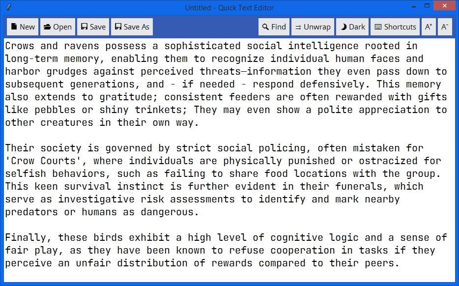
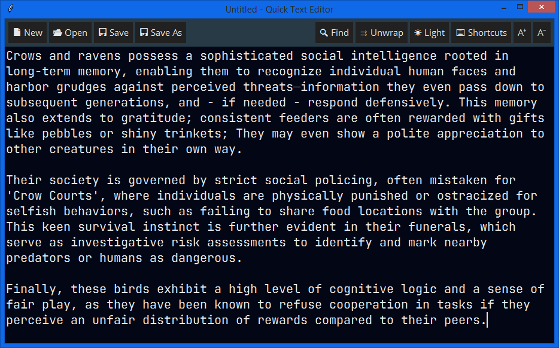

<div align="center">
  <h4 style="margin: 0; font-family: Arial, sans-serif; color: #d73a49; padding: 5px">Palestine Children, Women and Men are dying...</h4>
  
</div><br>


## About
Quick Text Editor is - you know - a handy plain text editor intended for simple use and designed to be cross platform. Not the best in its type, but still functional.<br>
> ***Under development. Bug report is highly appreciated!***

| Light Mode | Dark Mode |
| :---: | :---: |
|  |  |


## Before Usage
Please don't put the program in a protected folder, as it's designed to be
portable. Doing so will cause silent issues with reading/writing permissions.

There is a `Fonts` folder in the program directory, I recommend installing the `JetBrains Mono` and `Open Sans` fonts provided there. They are nice and clean and work well for this program.


## Quick Configuration
In the program directory, there will be (after the first launch) a `config.json` file. Its options should be clear, but just in case, here is the explanation of the necessary options:
```
'text_font_priority': This is a list of font types. If the first one is installed, the program will use it, otherwise it'll check the others in the written order.
'ui_font_priority': Same as above, but for UI elements.
'text_font_size': Font size for the text area.
'ui_font_size': Font size for the UI elements.
'indent_size': How many spaces to insert when pressing TAB.
'max_undo': How many undo steps to remember (lower = faster).
'big_file_size': Minimum file size (MB) to trigger a warning before opening.
'independent_windows': If true, each instance of this editor will spawn its own process. Slightly slower at startup, but recommended if you often open big files.
```

> To reset settings, simply delete the `config.json` file.


## Compile From Source
You can bundle the program easily using PyInstaller or cx_Freeze, but I recommend using Nuitka for a small performance gain:
```
pip install tkinterdnd2, Nuitka
cd "where/main.py/is"
python -m nuitka --deployment --disable-cache=all --standalone --prefer-source-code --noinclude-setuptools-mode=error --plugin-enable=tk-inter --enable-plugin=anti-bloat --python-flag=-S --python-flag=-O --python-flag=no_asserts --python-flag=no_docstrings --lto=yes --remove-output --force-stdout-spec=console_out.log --force-stderr-spec=console_err.log --windows-console-mode=disable --windows-icon-from-ico="Assets/icon.ico" --product-name="Quick Text Editor" --file-version=0.0.0 --output-filename=quick-text-editor main.py
```
> If you have a **Static Python** distribution, add this argument `--static-libpython=yes` to create a standalone release that doesn't rely on system shared libraries.


## Thank You
If you are reading this, then thank you for your time... <br>
If you find this program useful and satisfying, drop a 🌟!