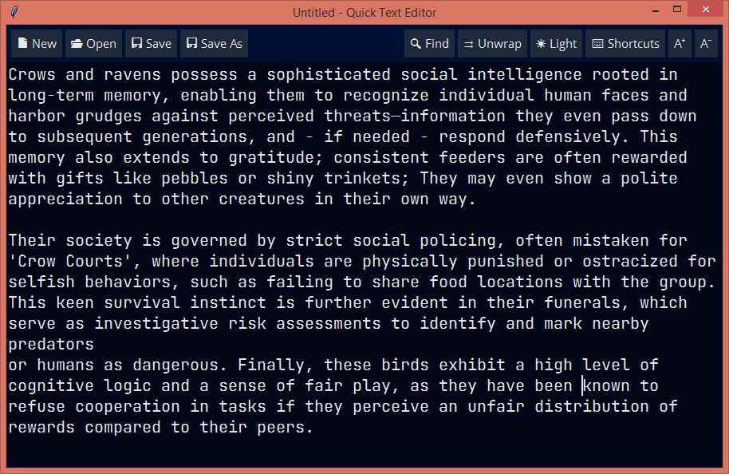

## About
Quick Text Editor is just - you know - a handy plain text editor intended for simple use. Designed to be standalone and cross platform. Not the best in its type, but still functional.<br>
***It's under development. Help is highly appreciated!*** <br><br>


## Before Usage
Please don't put the program in a protected folder, as it's designed to be
portable. Doing so will cause silent issues to save configuration settings.

There is a 'Fonts' folder in the program directory, I recommend installing the
'JetBrains Mono' and 'Open Sans' fonts provided there. They are nice and clean
and work well for this program.

To reset settings, simply go to 'Quick Text Editor' directory and delete the
'config.json' file.

## Compile From Source
You can bundle the program using PyInstaller or cx_Freeze, but I recommend using Nuitka for a small performance gain:
```
cd "where/main.py/is"
python -m nuitka --standalone --prefer-source-code --noinclude-setuptools-mode=error --plugin-enable=tk-inter --enable-plugin=anti-bloat --python-flag=-S --python-flag=-O --python-flag=no_asserts --python-flag=no_docstrings --lto=yes --windows-console-mode=disable --windows-icon-from-ico="Assets/icon.ico" --product-name="Quick Text Editor" --file-version=1.0.0 --output-filename=quick-text-editor main.py

```